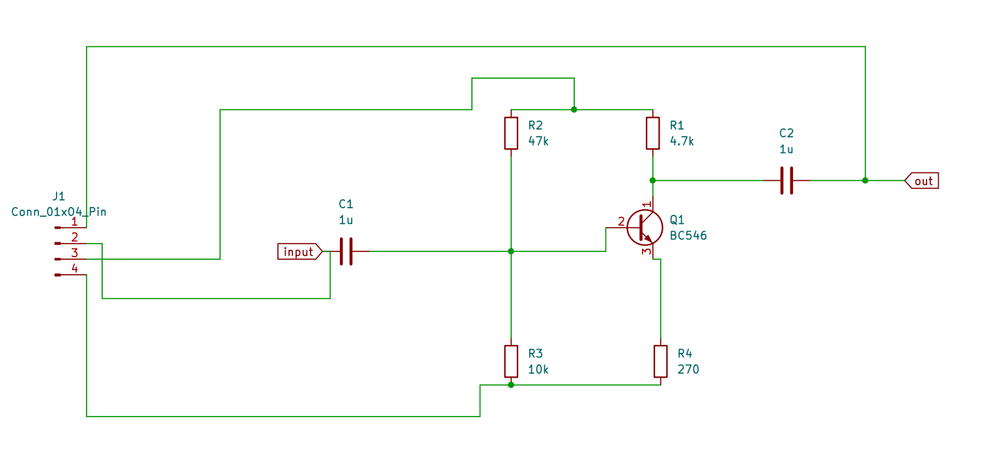
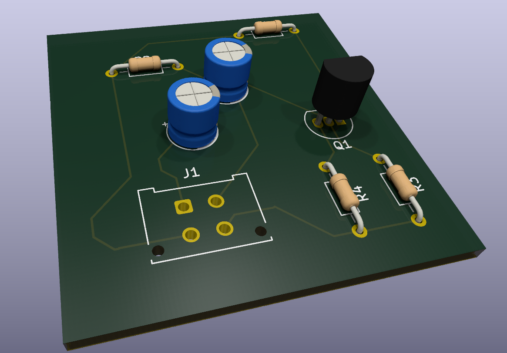

# KiCad Project
I decided to build the BJT circuit and learn about the capacitor's role.
Then I thought, why not design a PCB for this circuit?
The schematic below is what I used to design the PCB.
## Schematic

Be free to spot any error or give any suggestion
## Final Product

